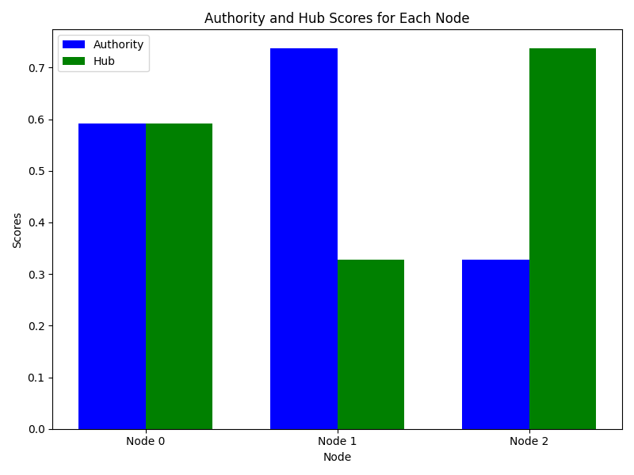

#### NAME: ROBINSON J

#### REG.NO: 212223040170

## Experiment-07 Implementation of Link Analysis using HITS Algorithm

## DATE: 19/10/24

### AIM: To implement Link Analysis using HITS Algorithm in Python.

### Description:

<div align = "justify">
The HITS (Hyperlink-Induced Topic Search) algorithm is a link analysis algorithm used to rank web pages. It identifies authority and hub pages 
in a network of web pages based on the structure of the links between them.

### Procedure:

1. **_Initialization:_**
<p>    a) Start with an initial set of authority and hub scores for each page.
<p>    b) Typically, initial scores are set to 1 or some random values.

2. **_Construction of the Adjacency Matrix:_**
<p>    a) The web graph is represented as an adjacency matrix where each row and column correspond to a web page, and the matrix elements denote the presence or absence of links between pages.
<p>    b) If page A has a link to page B, the corresponding element in the adjacency matrix is set to 1; otherwise, it's set to 0.

3. **_Iterative Updates:_**
<p>    a) Update the authority scores based on the hub scores of pages pointing to them and update the hub scores based on the authority scores of pages they point to.
<p>    b) Calculate authority scores as the sum of hub scores of pages pointing to the given page.
<p>    c) Calculate hub scores as the sum of authority scores of pages that the given page points to.

4. **_Normalization:_**
<p>    a) Normalize authority and hub scores to prevent them from becoming too large or small.
<p>    b) Normalize by dividing by their Euclidean norms (L2-norm).

5. **_Convergence Check:_**
<p>    a) Check for convergence by measuring the change in authority and hub scores between iterations.
<p>    b) If the change falls below a predefined threshold or the maximum number of iterations is reached, the algorithm stops.

6. **_Visualization:_**
<p>    Visualize using bar chart to represent authority and hub scores.

### Program:

```python
import numpy as np
import matplotlib.pyplot as plt

def hits_algorithm(adjacency_matrix, max_iterations=100, tol=1.0e-6):
    num_nodes = len(adjacency_matrix)
    authority_scores = np.ones(num_nodes)
    hub_scores = np.ones(num_nodes)

    for _ in range(max_iterations):
        # Authority update
        new_authority_scores = np.dot(adjacency_matrix.T, hub_scores)
        new_authority_scores /= np.linalg.norm(new_authority_scores, ord=2)  # Normalizing

        # Hub update
        new_hub_scores = np.dot(adjacency_matrix, new_authority_scores)
        new_hub_scores /= np.linalg.norm(new_hub_scores, ord=2)  # Normalizing

        # Check convergence
        authority_diff = np.linalg.norm(new_authority_scores - authority_scores, ord=2)
        hub_diff = np.linalg.norm(new_hub_scores - hub_scores, ord=2)

        if authority_diff < tol and hub_diff < tol:
            break

        authority_scores = new_authority_scores
        hub_scores = new_hub_scores

    return authority_scores, hub_scores

# Example adjacency matrix (replace this with your own data)
# For simplicity, using a random adjacency matrix
adj_matrix = np.array([
    [0, 1, 1],
    [1, 0, 0],
    [1, 1, 0]
])

# Run HITS algorithm
authority, hub = hits_algorithm(adj_matrix)
for i in range(len(authority)):
    print(f"Node {i}: Authority Score = {authority[i]:.4f}, Hub Score = {hub[i]:.4f}")

def sortByKey(li):
    li = dict(enumerate(li.tolist(), 1))
    return [i[0] for i in sorted(li.items(), key=lambda v: v[1], reverse=True)]
authority_rank = sortByKey(authority)
hub_rank = sortByKey(hub)
print("Rank based on Authority:")
for i in range(len(authority_rank)):
    print(f"Rank {i+1}: {authority_rank[i]}")

print("Rank based on Hub:")
for i in range(len(hub_rank)):
    print(f"Rank {i+1}: {hub_rank[i]}")

# bar chart of authority vs hub scores

nodes = np.arange(len(authority))
bar_width = 0.35
plt.figure(figsize=(8, 6))
plt.bar(nodes - bar_width/2, authority, bar_width, label='Authority', color='blue')
plt.bar(nodes + bar_width/2, hub, bar_width, label='Hub', color='green')
plt.xlabel('Node')
plt.ylabel('Scores')
plt.title('Authority and Hub Scores for Each Node')
plt.xticks(nodes, [f'Node {i}' for i in nodes])
plt.legend()
plt.tight_layout()
plt.savefig('output.png')
```

### Output:




### Result:

Successfully implemented Link Analysis using HITS Algorithm in Python.
